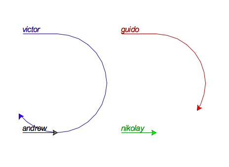

# aioturtle

Extension of the python standard library turtle module
to move turtles asynchronously using the asyncio
module and the new async/await syntax in python 3.5.

<table style="table-layout:fixed;"><tr>
<td style="width:45%;">

</td>
<td style="width:45%;">
<pre>
$ python -m aioturtle
TurtlePrompt version 0.0.0: Enter "help" for help, "quit" to exit.
aioturtle&gt; victor circle -100
&lt;Task pending coro=&lt;circle() running at /.../aioturtle/aioturtle.py:400&gt;&gt;
aioturtle&gt; guido circle -100
&lt;Task pending coro=&lt;circle() running at /.../aioturtle/aioturtle.py:400&gt;&gt;
aioturtle&gt;
</pre>
</td>
</tr></table>
